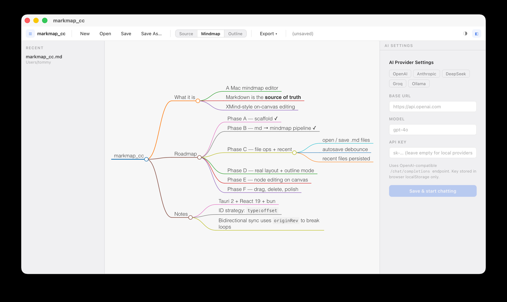

<div align="center">


# markmap_cc

**让 Markdown 与思维导图自由切换的原生桌面编辑器**

把每一份笔记，都变成可缩放、可编辑、可导出的脑图。

[](https://tauri.app)
[](https://react.dev)
[](https://www.typescriptlang.org)
[](https://www.rust-lang.org)
[](#-下载)
[](https://github.com/clearsky0601/markmap_cc/releases)

[English](./README.en.md) · **简体中文**

<br />



</div>

---

## ✨ 这是什么

`markmap_cc` 是一个用 **Tauri + React** 搭出来的桌面级 Markdown 思维导图编辑器。

它的核心想法很简单 — **Markdown 就是导图，导图就是 Markdown**：

- 写下一段 Markdown，左边是大纲、右边是脑图，**实时双向同步**。
- 直接在节点上双击改文字，对应的 Markdown 也会被精准改写（保留你原来的格式细节）。
- 觉得思路卡住了？右边有 AI Chat，**框选一片节点直接喂给模型**，让它顺着你的结构往下接。

## 🎯 核心功能

| | |
|---|---|
| 🧠 **Markdown ↔ 脑图双向同步** | 编辑器与 markmap 视图实时联动，所见即所得。 |
| ✍️ **节点就地编辑** | 双击节点直接改字；编辑层字号 / 内边距随缩放自适应。 |
| 🪟 **多选与框选** | 鼠标拖出选区批量选；`⌘+Click` 增减选中。 |
| ↩️ **撤销栈** | 全局 `⌘Z / ⌘⇧Z`，跨编辑器 / 脑图操作统一可撤销。 |
| 🤖 **内置 AI 对话** | 兼容 OpenAI / 任意 OpenAI-Compatible 供应商；支持把当前选区作为引用上下文。 |
| 📁 **文件树 + 最近打开** | 左侧侧边栏管理本地 Markdown 文件，最近打开自动归档。 |
| 👀 **外部改动检测** | 文件被外部编辑后，应用会询问是否重载，避免静默冲突。 |
| 💾 **自动保存** | 后台静默保存；`⌘S` 默认以 **一级标题** 作为文件名建议。 |
| 🎨 **主题切换** | 浅色 / 深色 / 跟随系统。 |
| 📤 **导出** | 一键导出 **PNG / SVG** 高清脑图。 |
| ⚡ **原生性能** | 走 Tauri，不是 Electron — 包体小、启动快、内存占用低。 |

## 📦 下载

**最新版本：[v0.1.0](https://github.com/clearsky0601/markmap_cc/releases/tag/v0.1.0)**

| 平台 | 文件 |
|---|---|
| 🍎 macOS (Apple Silicon) | [`markmap_cc_0.1.0_aarch64.dmg`](https://github.com/clearsky0601/markmap_cc/releases/download/v0.1.0/markmap_cc_0.1.0_aarch64.dmg) |
| 📦 源码 | [`markmap_cc-0.1.0-source.zip`](https://github.com/clearsky0601/markmap_cc/releases/download/v0.1.0/markmap_cc-0.1.0-source.zip) |

> ⚠️ 当前仅提供 macOS Apple Silicon 构建。Intel Mac / Windows / Linux 构建在路上。

> 由于应用未签名，首次打开时 macOS 会提示「无法验证开发者」，可在 *系统设置 → 隐私与安全性* 中放行，或终端执行：
>
> ```bash
> xattr -dr com.apple.quarantine /Applications/markmap_cc.app
> ```

## ⌨️ 快捷键

| 操作 | 快捷键 |
|---|---|
| 打开文件 | `⌘O` |
| 保存 | `⌘S` （未命名时默认以 H1 标题命名） |
| 撤销 / 重做 | `⌘Z` / `⌘⇧Z` |
| 多选节点 | `⌘+Click` |
| 框选节点 | 在画布空白处按住拖动 |

## 🛠️ 从源码构建

需要 [Rust](https://www.rust-lang.org/tools/install) (1.77+) 与 [Bun](https://bun.sh) (推荐) 或 Node.js + npm。

```bash
# 拉代码
git clone https://github.com/clearsky0601/markmap_cc.git
cd markmap_cc

# 安装依赖
bun install

# 开发模式（热更新）
bun tauri dev

# 打 release 包（macOS 下产出 .app + .dmg）
bun tauri build
# 产物：src-tauri/target/release/bundle/{macos,dmg}/
```

## 🧱 技术栈

<table>
  <tr>
    <td><b>前端</b></td>
    <td>React 19 · TypeScript · Vite · Zustand · CodeMirror 6 · markmap-lib · markmap-view</td>
  </tr>
  <tr>
    <td><b>Markdown 解析</b></td>
    <td>unified · remark-parse · mdast-util-to-markdown · unist-util-visit</td>
  </tr>
  <tr>
    <td><b>桌面壳层</b></td>
    <td>Tauri 2 · Rust 2021 · notify · reqwest</td>
  </tr>
  <tr>
    <td><b>插件</b></td>
    <td>tauri-plugin-fs · tauri-plugin-dialog · tauri-plugin-store · tauri-plugin-log</td>
  </tr>
</table>

## 🗺️ 路线图

- [ ] Intel Mac (`x86_64-apple-darwin`) 构建
- [ ] Windows / Linux 构建
- [ ] 应用签名 + 自动更新
- [ ] 标签 / 反向链接 / 全文搜索
- [ ] 节点级折叠状态持久化
- [ ] 移动端（iPad）适配研究

## 🤝 贡献

欢迎 issue 与 PR。开发流程：

1. Fork → 新分支 → 改动 → `bun run lint` → `bun tauri build` 自检
2. 提交 PR 描述：动机、变更点、截图（UI 类）

## 🙏 致谢

- [markmap](https://github.com/markmap/markmap) — 让 Markdown 渲染成脑图的核心
- [Tauri](https://tauri.app) — 让 Web 应用变成 5MB 的原生桌面包
- [CodeMirror](https://codemirror.net) — 优雅的代码编辑器内核

---

<div align="center">

如果这个项目对你有帮助，给个 ⭐ 是最大的鼓励 ✨

</div>
